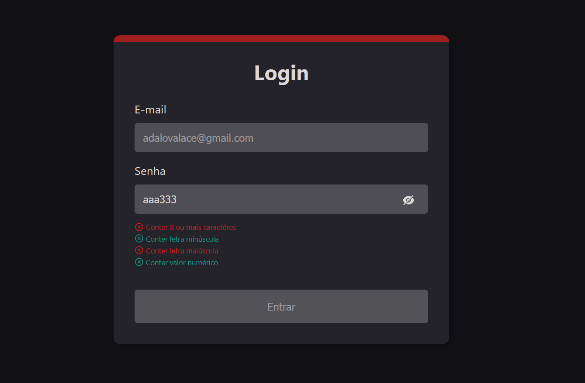

# Validator
Esse projeto foi bem mais tranquilo, e consegui fazer em poucas horas toda a dinâmica necessária para a validação. Inclusive, eu até cheguei a instalar o React Hook Form, mas achei que seria mais interessante criar meu próprio sistema de validação de formulário, então o maior desafio foi pensar na estrutura necessária para fazer todos os tratamentos.
No final eu fiz um estado da aplicação usando o hook useState que recebe um objeto contendo todas as validações a serem realizadas setadas como false. Então, a cada mudança no valor do input, eu verificava se o valor estava satisfazendo uma condição, e caso afirmativo, mudava este valor para true. Assim, as dicas de preenchimentos puderam ser manipuladas individualmente, e para realizar a habilitação do botão bastou verificar se todos os valores do objeto estavam como true.

## Próximos passos
Para complementar a estrutura atual do projeto seria interessante extrair a lógica de validação da aplicação para componentes e hooks a parte, os quais poderiam ser chamados para serem usados de forma ainda mais simplificada. Este poderia ser inclusive um sistema alternativo ao do próprio React Hook Form.

